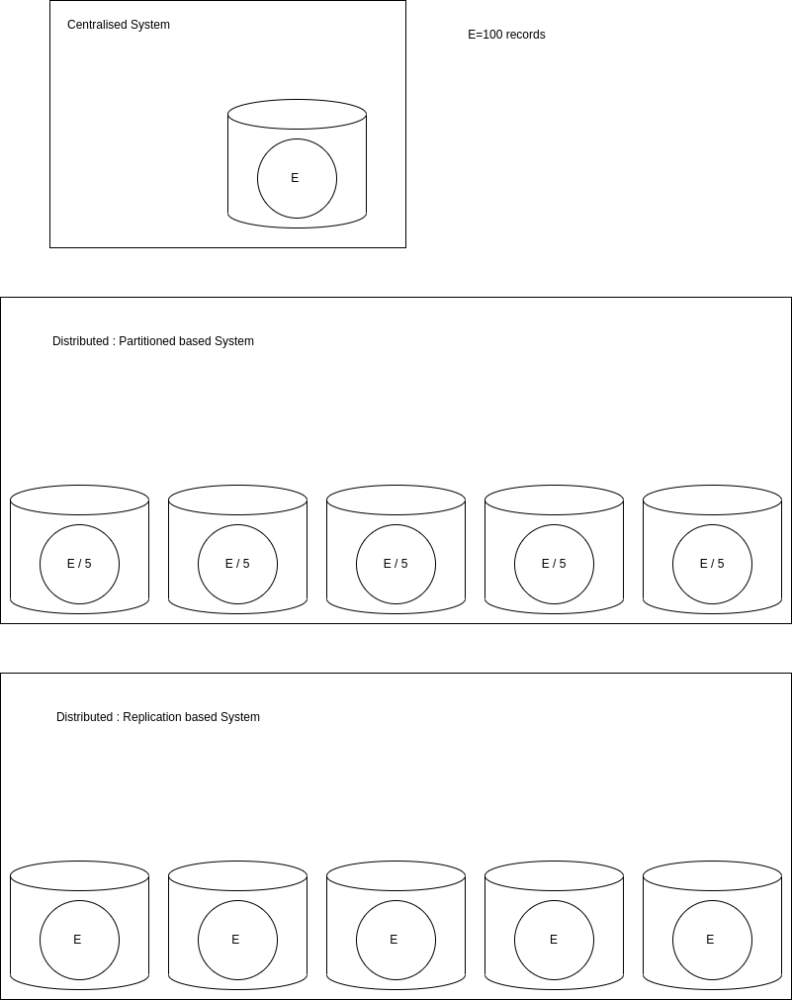
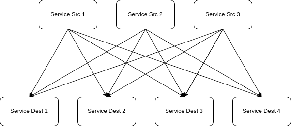

# Apache Kafka concepts

> Apache Kafka is a high throughput distributed Messaging system.

## Introduction

Apache Kafka is a *distributed* **Message streaming platform** that uses **publish and subscribe (pub/sub)** mechanism to stream the records. Originally developed by LinkedIn and later donated to "Apache" Foundation. Kafka is a open source system. Currently many big enterpreise companies such as LinkedIn, Airbnb, Netflix, Uber , Walmart, etc. uses Apache Kafka.

> Key points
* Streaming means flow.
* records means data.

### Before going deep into Apache Kafka, let us understand few storage terms and mechanisms

* **Centralised System** : Here all the entity/data is saved into a single system/server. In case of loss of the server/system, it will cause us to lose all the data.

* **Distributed System** : The Distributed system can be divided into 2 types:
* a. **Partition based System**: In this case the whole entity are divided based on the algorithm (might be equally, or unevenly ). In case of failure of Partition based system, we will only lose the entity of the failed service, but rest of the them will be still there.

* b. **Replication based System** : The problem of the partition based system can be overcome using *Replication*, but it requires more storage space and causes data redundancy. And if any of the service fails, the data will still persists and there wont be any loss of data.

***Kafka uses distribution based system and uses the both types of distributed system i.e Partition and replication approach, it upto us that how we configure.***

--- 
## Message Streaming Platform :

Here, let us assume there are 3 source services that needs to connect to 4 Destination service to provide data to. Therefore One-to-One Integration requires us to write 3 x 4 = 12 intergrations here, which are tightly coupled. This means 1 source service needs to connect to all the 4 Destination services which means 3 source service needs 3 x 4 integrations.

These types of systems where highly/tightly coupled. To overcome this scenario *Messaging System* were introduced.

