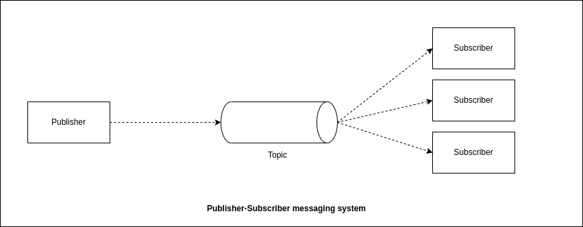

# Apache Kafka concepts

> Apache Kafka is a high throughput distributed Messaging system.

## Introduction

Apache Kafka is a *distributed* **Message streaming platform** that uses **publish and subscribe (pub/sub)** mechanism to stream the records. Originally developed by LinkedIn and later donated to "Apache" Foundation. Kafka is a open source system. Currently many big enterpreise companies such as LinkedIn, Airbnb, Netflix, Uber , Walmart, etc. uses Apache Kafka.

> Key points
* Streaming means flow.
* records means data.

### Before going deep into Apache Kafka, let us understand few storage terms and mechanisms

* **Centralised System** : Here all the entity/data is saved into a single system/server. In case of loss of the server/system, it will cause us to lose all the data.

* **Distributed System** : The Distributed system can be divided into 2 types:
* a. **Partition based System**: In this case the whole entity are divided based on the algorithm (might be equally, or unevenly ). In case of failure of Partition based system, we will only lose the entity of the failed service, but rest of the them will be still there.

* b. **Replication based System** : The problem of the partition based system can be overcome using *Replication*, but it requires more storage space and causes data redundancy. And if any of the service fails, the data will still persists and there wont be any loss of data.

***Kafka uses distribution based system and uses the both types of distributed system i.e Partition and replication approach, it upto us that how we configure.***

--- 
## Message Streaming Platform :

Here, let us assume there are 3 source services that needs to connect to 4 Destination service to provide data to. Therefore One-to-One Integration requires us to write 3 x 4 = 12 intergrations here, which are tightly coupled. This means 1 source service needs to connect to all the 4 Destination services which means 3 source service needs 3 x 4 integrations.

These types of systems where highly/tightly coupled. To overcome this scenario *Messaging System* were introduced.

In this system every services are connected to the messaging system and then who needs the data can connect and get the data from there.

Now, the question arises this process can be done using the database as well, then why do we need Apache Kafka,
we that's true but the database operations are costly and it cannot send notifications to the services when data arrives.

---
 ## Messaging System : 

A messaging system is responsible for transferring data from one application to another so that the application can focus on processing the data instead of getting bogged on data transmission and sharing.

It is of 2 types.:
* Point-to-Point Messaging System
* Publish-Subscribe Messaging System

> Point-to-Point Messaging System

* Messages are persisted in a Queue.
* A particular message can be consumed by a maximum of one receiver only.
* There is no time dependency laid for the receiver to receive the message.
* When the receiver receives the message, it will send an acknowledgement.

> Publish-Subscribe Messaging System

* Messages are persisted in a Topic.
* A particular message can be consumed by any number of consumers.
* There is a time dependency laid for the consumer to consume the message.
* When the subscriber receives the message, it doesn't send the acknowledgement back to the publisher.

---

## Kafka Architecture

### Topic
* A stream of messages belonging to a particular category is called a topic.
* It is a logical unique name to which records are published.
* Records are considered as messages here.
* Unique identifier of a topic is it's `NAME`.
* We can create as many topic as we want.

### Partitions
* Topics are split in Partitions.
* All the messages within a partition are ordered and immutable.
* Each messages within a partition has a UNIQUE `ID`associated with it known as `offset`.
* Partitions are distributed into broker using "*Round-Robin*".

### Replica and Replication
* Replicas are backups of a partitions.
* You cannot read or write data to a replica directly.
* They are used to prevent the data loss (Fault tolerance).

### PRODUCER
* Producer are application which write/publish data to the topic within a cluster using the Producer APIs.
* Producer can write data either on the topic level (all the partitions of that topic) or specific partition of the topic.

### CONSUMER
* Consumers are application which read/consume data from the topics within a cluster using the Consumer APIs.
* Consumer can read data either in the topic level. (All the partitions of that topic) or specific partition of the topic.
* Consumer are always associated with exactly one Consumer Group.
* A Consumer Group is a group of related consumer that performs a task.

### BROKER
* Brokers are simple software process who maintain and manage the published messages.
* Also known as *Kafka Servers*
* Brokers also manage the consumer-offsets and are responsible for the delivery of messages to the right consumers.
* A set of brokers who are communicating with each other to perform the management and maintenance tasks are collectively known as "Kafka clusters"
* We can add more brokers in a already running kafka cluster without any downtime. (This is useful for horizontal scaling)

### Zookeeper
* Zookeeper is used to monitor *Kafka Cluster* and co-ordinate with each broker.
* Zookeeper keeps all the meta-data information related to "*Kafka cluster*" in the form of a key-value pair.
* Metadata includes:
  * Configuration information
  * Health status of each broker
* It is used for the controller election within Kafka cluster.
* A set of Zookeeper nodes working together to manage other distributed system in known as *Zookeeper cluster* or *Zookeeper Ensemble*.

---

## Kafka features
> Benefits of kafka over other messaging systems:

* **Scalable** : Horizontal Scaling can be done by adding new broker to the existing cluster without any shutdown or data-loss.
* **Fault Tolerance** : Kafka clusters can handle failures because of its distributed nature.
* **Durable** : Kafka uses "Distributed commit logs" which means messages persists on a disk as fast as possible.
* **Performance** : Kafka has "*high throughput*" for both publishing and subscribing messages. (high throughput means high performance.)
* **No Data loss** : It ensures no data loss if we can configure it properly.
* **Zero Downtime** : It ensures zero downtime when required numbers of brokers are present in the cluster.
* **Reliability** : Kafka is reliable because of the zero-downtime policy.

---

## KAFKA APIs
* Producer APIs
* Consumer APIs
* Streams APIs
* Connector APIs
* Admin APIs

---

# Installing Apache Kafka and Zookeeper

> Pre-requisites

* Java 8 or higher
* RAM > 512 MB
* Download the binary files of latest version of kafka.
* Download the binary files of the latest version of Zookeeper.

*Before installing Apache Kafka, we need to install zookeeper*.

### Steps to install the Zookeeper.

* Download the latest release from it's release page : https://zookeeper.apache.org/releases.html .
* Unzip it 
* Go to the config folder and add